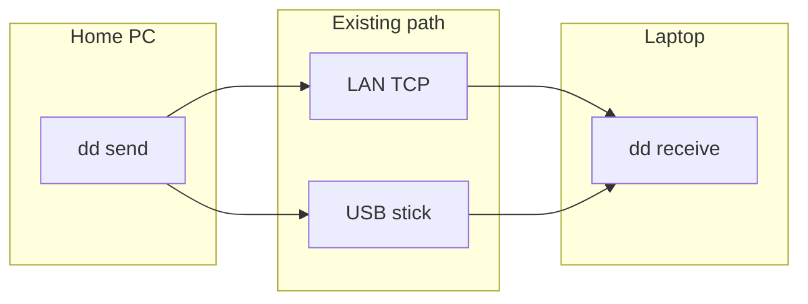
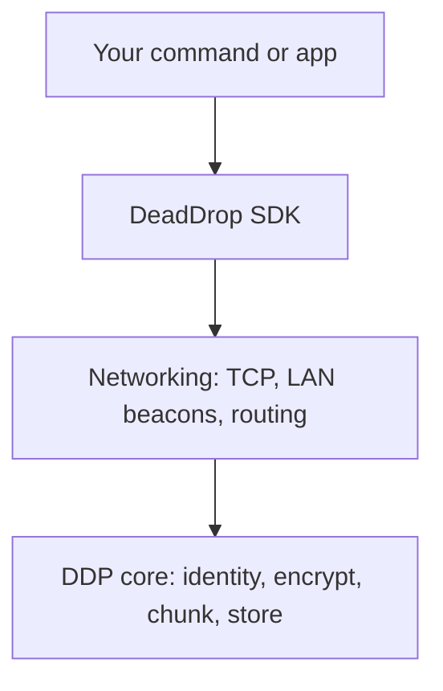
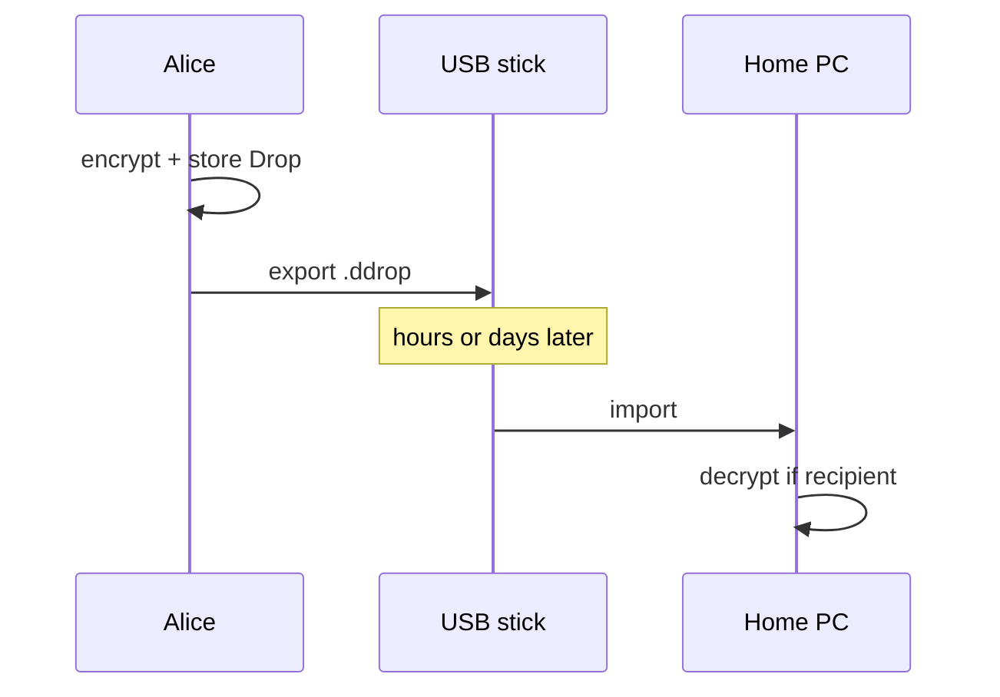

# DeadDrop

**Encrypted delay-tolerant networking for computers that are not always online at the same time.**

Install it on a machine at home. Install it on a laptop. Send a file. When the two machines can reach each other — same Wi‑Fi, a USB stick, a visit later — the file moves. Neither side has to stay connected.

No account. No cloud. No assumption that both endpoints are up at once.

```
Store it.  Carry it.  Discover.  Exchange.  Forward.
```



The machines never need a simultaneous live session for the *application* to queue work. Delivery happens on the next contact: a TCP session on your LAN, or a `.ddrop` file you copy onto a stick.

## Install

Download `dd` from [GitHub Releases](https://github.com/theworker02/deaddrop/releases) (Linux, Windows, and macOS, x86_64 and ARM64). Archives include `dd`, `dd-daemon`, `dd-relay`, and `dd-sim`, SHA-256 checksums, an SPDX SBOM, and Sigstore bundles.

```bash
# from a release (needs cargo-binstall)
cargo binstall --git https://github.com/theworker02/deaddrop deaddrop-app

# Homebrew formula attached to the release (not homebrew-core)
brew install --formula https://github.com/theworker02/deaddrop/releases/latest/download/deaddrop.rb
```

Windows: download the `x86_64-pc-windows-msvc.zip` or the `winget/` manifests from the same release and run `winget install --manifest <dir>`.

From source:

```bash
git clone https://github.com/theworker02/deaddrop
cd deaddrop
cargo install --path crates/deaddrop-app --locked
```

Or run in place:

```bash
cargo run -p deaddrop-app --bin dd -- --help
```

Binaries: `dd`, `dd-daemon`, `dd-relay`, `dd-sim`.

## Two computers on a home network

**Computer A** (the one that will listen, e.g. the desktop):

```bash
dd --data-dir ./home init
dd --data-dir ./home daemon start --listen 0.0.0.0:7947
dd --data-dir ./home daemon install   # optional: start at login (systemd user / LaunchAgent / Windows logon task)
```

Copy `./home/identity.pub.ddcontact` to the other computer (shared folder, email to yourself, USB — anything).

**Computer B** (the one that sends, e.g. the laptop):

```bash
dd --data-dir ./laptop init
dd --data-dir ./laptop import ./identity.pub.ddcontact --name home
dd --data-dir ./laptop send ./photo.jpg --to home
dd --data-dir ./laptop connect --to home
```

If beacons are blocked, pass the home PC LAN IP: `dd connect --peer 192.168.1.20:7947`. Windows: `ipconfig`. macOS/Linux: `ip addr` or `ifconfig`.

`dd peer list` shows imported contacts plus any live LAN address the daemon is advertising.

**Computer A**, after the session:

```bash
dd --data-dir ./home receive
```

The payload is end-to-end encrypted. The listening node decrypts only if it is the recipient. A machine that merely forwards or carries a Drop cannot read a private file.

`dd connect` is an alias of `dd sync`. With the daemon running on the other computer it can pick up the LAN beacon and skip typing an IP.

## No network? USB sneakernet

On the sender:

```bash
dd --data-dir ./laptop export pending --output E:/pending.ddrop
```

Walk the stick to the other computer:

```bash
dd --data-dir ./home import E:/pending.ddrop
dd --data-dir ./home receive
```

That is the same protocol object as a LAN transfer — stored, carried, imported, decrypted.

## What this is (and is not)

| Works today | Not in this tree |
| --- | --- |
| Encrypted Drops, content-addressed chunks | Bluetooth / BLE |
| TCP sessions on your LAN | Wi-Fi Direct |
| UDP LAN beacons when the daemon is running | A required cloud |
| USB / folder `.ddrop` carriers | Anonymity |
| Resume at chunk boundaries | WASM routing plugins |

Wire protocol: **DDP/2**. Crate version: **2.6.0**.

```
Application  →  deaddrop-sdk  →  deaddrop-net  →  deaddrop-core
```

## Architecture



Delay-tolerant path — none of these hops need to exist at the same moment:



## CLI

```text
dd init | status | identity | peer | send | receive
dd daemon start | stop | status | install | uninstall
dd connect | dd connect --to NAME | dd sync --peer HOST:7947
dd export pending | import
dd peer list | radar | doctor [--repair] | inspect | completion
```

Every command has `--help`. Machine output: `--json`. Completions: `dd completion powershell` (also bash, zsh, fish).

## SDK

```rust
let dd = deaddrop_sdk::DeadDrop::open_dir(std::path::Path::new("./home"))?;
dd.send(deaddrop_sdk::Recipient::from("laptop"), b"hello").await?;
```

Applications should depend on `deaddrop-sdk` only.

## Docs and spec

- [Getting started](docs/getting-started.md)
- [Two computers](examples/two-computers.md)
- [Protocol](spec/DDP-0000-overview.md)
- [Security](SECURITY.md) · [Threat model](THREAT_MODEL.md)
- [Contributing](CONTRIBUTING.md) · [Roadmap](ROADMAP.md)

## License

MIT OR Apache-2.0
