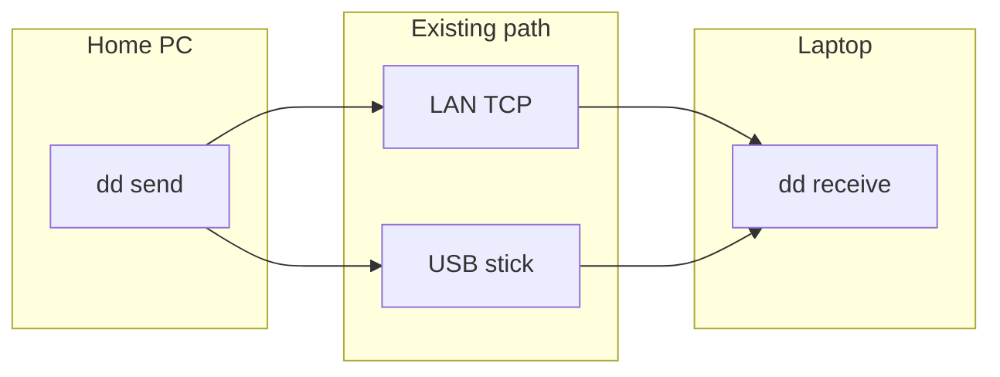

# Buyer evaluation — DeadDrop

## Goal

In 15–45 minutes, verify the Product builds or runs as documented and that proprietary notices are present.

## Steps

1. Confirm root `LICENSE` is proprietary and `ACQUISITION.md` exists.
2. Skim `README.md` install/run claims.
3. Execute:

```
```
Store it.  Carry it.  Discover.  Exchange.  Forward.
```

```bash
cargo install deaddrop-app --locked
```
```bash
# from a release (needs cargo-binstall)
cargo binstall --git https://github.com/theworker02/deaddrop deaddrop-app

# Homebrew formula attached to the release (not homebrew-core)
brew install --formula https://github.com/theworker02/deaddrop/releases/latest/download/deaddrop.rb
```
```bash
git clone https://github.com/theworker02/deaddrop
cd deaddrop
cargo install --path crates/deaddrop-app --locked
```
```bash
cargo run -p deaddrop-app --bin dd -- --help
```
```bash
dd --data-dir ./home init
dd --data-dir ./home daemon start --listen 0.0.0.0:7947
dd --data-dir ./home daemon install   # optional: start at login (systemd user / LaunchAgent / Windows logon task)
```

4. Run tests if present (`npm test`, `pytest`, `cargo test`, `go test ./...`, etc.).
5. Record README vs observed behavior gaps in workpapers.

## Pass criteria

- [ ] Clone succeeds
- [ ] Documented happy path works **or** failure is explained
- [ ] Minimal path needs no surprise secrets
- [ ] License notices intact

*Updated: 2026-09-22*
